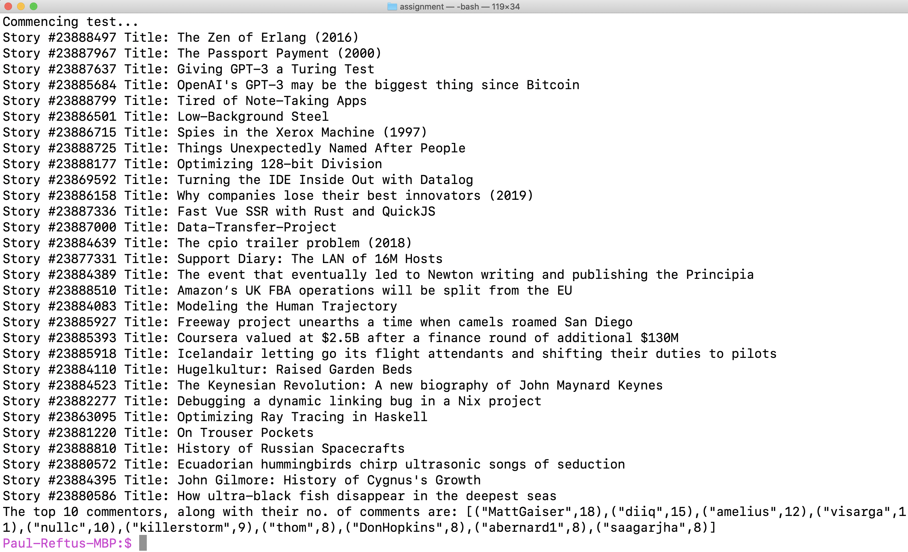

# HackerNewsApi Crawler

Based on the API provided by HackerNews at: https://hackernews.api-docs.io/v0/overview/introduction.

The "HackerNewsApi Crawler" is a small tool written in Haskell used to crawl through HackerNews' stories data using their API
and to find out who the top `x` commentors of the top `y` stories are, along with their number of comments.

By default, the information w.r.t. the top 10 commentors are sought, from within the top 30 stories.

To run this tool, simply use `stack build`, followed by `stack run`. Note that it may take, on average, about 3 seconds to obtain
the information of the top 30 stories, as well as about 3 minutes to obtain the top 10 commentors' information.

This time may thus vary if the input parameters `(x, y)` are higher.

Technologies used to build this tool:
1) Haskell
2) Streamly library (a reactive streams library for Haskell: https://hackage.haskell.org/package/streamly)

Here is a preview of the tool, run from the command line:

 

